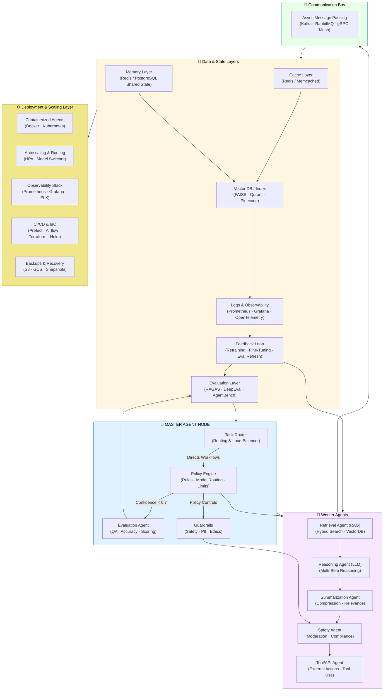

# 🧠 Industrial Agentic AI System — Full Architecture Documentation (2025 Edition)

This document provides a comprehensive explanation of every layer, node, and interconnection in the **Agentic AI + RAG Architecture**, designed for production deployment and continuous learning systems.

---

## 🧩 System Architecture Diagram

```
                           ┌─────────────────────────────────────────────────────┐
                           │                🧠 MASTER AGENT NODE                 │
                           │ Orchestrator · Global State · Routing · Policy Ctrl │
                           └───────────────┬─────────────────────────────────────┘
                                           │
              ┌────────────────────────────┼─────────────────────────────┐
              │                            │                             │
       ┌──────▼──────┐             ┌───────▼────────┐             ┌──────▼──────┐
       │  Task Router│             │  Policy Engine │             │ Eval. Agent │
       │  (Routing   │             │  (Rules / Lims)│             │ (QA / Scor.)│
       │  & Balancer)│             └───────┬────────┘             └──────┬──────┘
       └──────┬──────┘                     │                             │
              │                     +------+------+
              │                     | Guardrails  |
              │                     | (Safety / PII / Ethics)|
              │                     +------+------+
              │                            │
   ┌──────────┼─────────────┬──────────────┼──────────────┐
   │          │             │              │              │
┌──▼──┐   ┌───▼──┐     ┌────▼───┐     ┌────▼────┐    ┌────▼────┐
│Agent│   │Agent │     │Agent   │     │Agent    │    │Agent    │
│Retr.│   │Reason│     │Summar. │     │Safety   │    │Tools/API│
│(RAG)│   │(LLM) │     │(LLM)   │     │Checks   │    │Actions  │
└──┬──┘   └──┬───┘     └───┬────┘     └───┬─────┘    └───┬─────┘
   │          │             │              │              │
   │          │             │              │              │
   │          │             │              │              │
   └─────┬────┴────┬────────┴──────────────┴──────────────┘
         │          │
         │          │
         ▼          ▼
   ┌───────────────────────────┐
   │     Communication Bus     │  ⇢ (Kafka / RabbitMQ / gRPC Mesh)
   │ Async Msg Passing · Pub/Sub│
   └──────────┬────────────────┘
              │
   ┌──────────┼────────────────────────────────────────────────────────────────────────────────────┐
   │          │                 │                    │                      │                      │
┌──▼──┐   ┌───▼────┐        ┌───▼────┐          ┌────▼────┐           ┌────▼────┐           ┌─────▼──────┐
│Cache│   │Memory  │        │Vector  │          │Logs/Obs │           │Feedback │           │ Eval Layer │
│(Redis)│ │Layer   │        │DB/Index│          │(Prom/Graf)│         │Loop     │           │ (RAGAS ·   │
│Query+│ │(Redis) │        │(FAISS,  │          │Traces) │         │(Train,  │           │ DeepEval · │
│Resp. │ │Shared  │        │Qdrant)  │          │Metrics)│         │Retrain) │           │ AgentBench)│
└──┬───┘ └───┬─────┘        └───┬────┘          └────┬────┘           └────┬────┘           └─────┬──────┘
    │        │                  │                      │                      │                      │
    │        └──────────────────┴──────────────────────┼──────────────────────┼──────────────────────┘
    │                              Conditional Edges ⇢ │
    │                                                   │
    ▼                                                   ▼
┌────────────────────────────────────────────────────────────────────────────────────────────────────────┐
│          Deployment & Scaling Layer                                                                   │
│  • Containerized Agents (Kubernetes, Docker)                                                          │
│  • Autoscaling (HPA) · Blue/Green Index Deployment                                                    │
│  • Observability Stack (Prometheus, Grafana, ELK, OpenTelemetry)                                      │
│  • CI/CD (Prefect / Airflow / LangGraph Orchestration + IaC Terraform/Helm)                           │
│  • Cost & Token Budgeting · Model Routing (small→large)                                               │
│  • Disaster Recovery & Backups (S3 / GCS / Snapshots)                                                 │
└────────────────────────────────────────────────────────────────────────────────────────────────────────┘
```
---
## 🪄 Visual Flowchart — Agentic AI + RAG Orchestration System


---

## 1️⃣ Master Agent Node — Central Orchestrator
**Role:** The brain of the system — coordinates all agents, maintains global state, and controls workflow routing through policies and confidence thresholds.

**Free Tools:** LangGraph, Prefect, Celery  
**Paid Tools:** LangSmith, Databricks Workflows, AWS Step Functions

---

## 2️⃣ Task Router
**Role:** Distributes tasks to appropriate specialized agents based on type, cost, and complexity.

**Free Tools:** Kafka, FastAPI Routers  
**Paid Tools:** AWS SQS, Temporal.io, Google Pub/Sub

---

## 3️⃣ Policy Engine
**Role:** Defines governance rules, routing thresholds, model selection logic, and safety limits.

**Free Tools:** Pydantic, Open Policy Agent (OPA)  
**Paid Tools:** Lakera AI, NVIDIA NeMo Guardrails, Anthropic Safety API

---

## 4️⃣ Evaluation Agent
**Role:** Monitors output quality, measures accuracy, and ensures each agent’s output meets benchmarks.

**Free Tools:** RAGAS, DeepEval, TruLens  
**Paid Tools:** Weights & Biases Eval Suite, PromptLayer, Databricks LLMOps

---

## 5️⃣ Guardrails (Safety / PII / Ethics)
**Role:** Protects system integrity by filtering unsafe, biased, or non-compliant content.

**Free Tools:** Guardrails-AI, Presidio, Rebuff  
**Paid Tools:** Lakera AI, Azure Content Safety, NeMo Guardrails

---

## 6️⃣ Worker Agents

### 🔍 Retrieval Agent (RAG)
Fetches documents from the Vector DB using embeddings and hybrid search.  
**Tools:** FAISS, Chroma, Qdrant, Pinecone, Weaviate

### 🧠 Reasoning Agent (LLM)
Performs multi-step reasoning and logic tasks using LLMs.  
**Tools:** LangGraph, CrewAI, AutoGen, GPT-4o, Claude 3

### ✍️ Summarization Agent
Compresses large contexts while maintaining factual grounding.  
**Tools:** Transformers, LlamaIndex, OpenAI Summarize API

### 🧩 Safety Agent
Executes moderation and compliance validation in parallel.  
**Tools:** Presidio, spaCy NER, NeMo Guardrails

### 🔧 Tools/API Agent
Handles API calls and tool-use functions for external systems.  
**Tools:** LangChain Tools, FastAPI, Zapier AI Actions, AWS Lambda

---

## 7️⃣ Communication Bus
**Role:** Facilitates async communication between agents and orchestration layers.  
**Free Tools:** Kafka, RabbitMQ, gRPC  
**Paid Tools:** AWS EventBridge, Google Pub/Sub

---

## 8️⃣ Storage & Caching
| Component | Purpose | Free Tools | Paid Tools |
|------------|----------|-------------|-------------|
| Cache Layer | In-memory query caching | Redis | Upstash Redis, AWS ElastiCache |
| Memory Layer | Session & state persistence | Redis, PostgreSQL | Pinecone Cache, Supabase |
| Vector DB | Semantic retrieval | FAISS, Qdrant | Pinecone, AWS Kendra |

---

## 9️⃣ Logging & Observability
Monitors latency, throughput, costs, and error traces.  
**Free Tools:** Prometheus, Grafana, OpenTelemetry  
**Paid Tools:** Datadog, LangSmith Metrics, W&B Telemetry

---

## 🔁 10️⃣ Feedback & Continuous Learning Loop
Aggregates evaluation metrics and triggers retraining pipelines.  
**Free Tools:** LoRA, PEFT, MLflow, TruLens  
**Paid Tools:** Databricks AutoML, AWS SageMaker, Cohere Finetune API

---

## 11️⃣ Evaluation Layer (RAGAS · DeepEval · AgentBench)
Provides automated benchmarking for retrieval accuracy, factual faithfulness, and agentic reasoning.

| Framework | Purpose | Key Metrics |
|------------|----------|-------------|
| RAGAS | Retrieval grounding evaluation | Context Precision · Faithfulness |
| DeepEval | LLM factual correctness | Coherence · Consistency |
| AgentBench | Multi-agent collaboration testing | Tool Success · Planning Depth |

---

## 12️⃣ Deployment & Scaling Layer
Handles container orchestration, CI/CD, autoscaling, and cost optimization.

**Free Tools:** Docker, Kubernetes, Helm, Terraform, ArgoCD  
**Paid Tools:** AWS EKS/ECS, Azure AKS, Modal, RunPod, GCP GKE

---

## ✅ End-to-End Lifecycle

```
Input → Master Node → Router → Agents → Guardrails → Communication Bus → Storage
↓
Evaluation (RAGAS / DeepEval / AgentBench)
↓
Feedback Loop → Retraining → Deployment → Continuous Monitoring
```
## 🧠 Insight
A true **industrial-grade Agentic AI system** is not just a model pipeline —  
it’s an *ecosystem of autonomous agents* operating under continuous governance, evaluation, and self-improvement — enabling **trust, transparency, and scalability** at enterprise scale.
